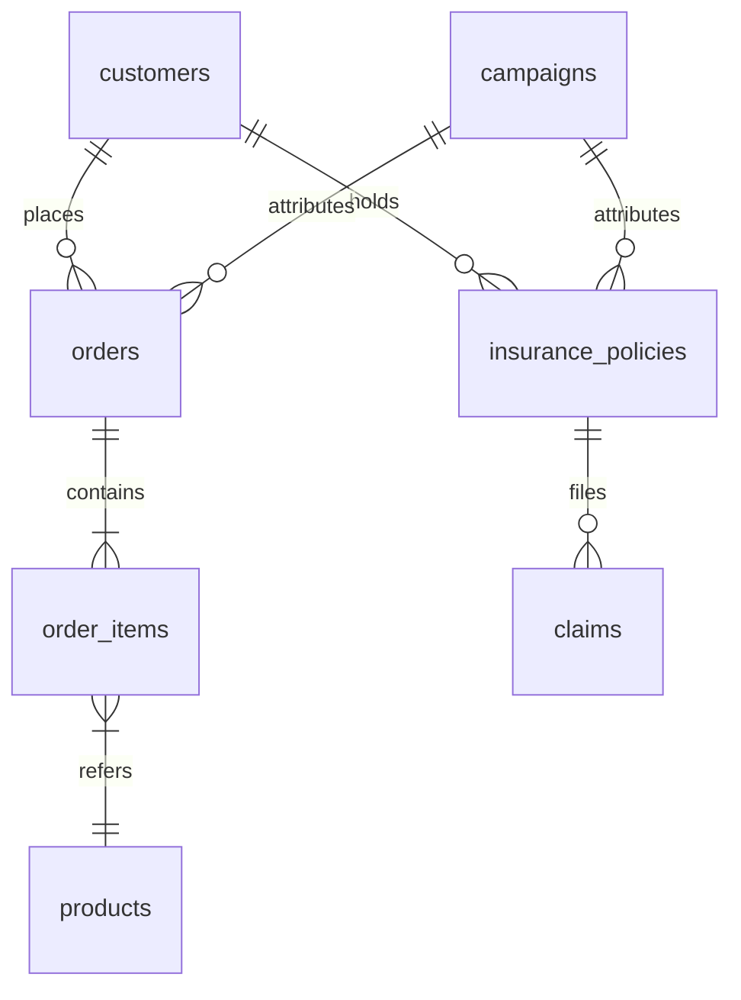

# TokoAman.id — E-Commerce & Embedded Insurtech BI Analytics

## Business Problem
**TokoAman.id** adalah marketplace e-commerce enterprise yang menjual produk ritel sekaligus produk asuransi mikro langsung di checkout (*embedded insurance*) — proteksi gadget, asuransi pengiriman, dan asuransi perjalanan. 

Manajemen membutuhkan visibilitas analitis tingkat tinggi untuk menjawab 5 pertanyaan bisnis paling krusial:
1. **Sales & Revenue Forecasting**: Berapa estimasi pendapatan bulan depan dan bagaimana pola musimannya?
2. **Customer Churn Risk Model**: Pelanggan mana yang berisiko berhenti belanja / tidak memperpanjang polis asuransi?
3. **RFM Segmentation**: Siapa kelompok pelanggan paling berharga (*Champions*) vs yang membutuhkan perhatian khusus (*At Risk*)?
4. **Marketing ROI & ROAS**: Kanal iklan (*Instagram Ads, TikTok Ads, Google Ads*) mana yang menghasilkan return paling menguntungkan?
5. **A/B Testing Experimentation**: Apakah perubahan desain checkout baru secara signifikan meningkatkan tingkat konversi transaksi?

---

## Architecture & Data Warehouse (Google BigQuery)
Seluruh data terintegrasi ke dalam data warehouse **Google BigQuery** pada dataset `tokoaman_bi`:
* **Core Tables**: `customers`, `products`, `campaigns`, `orders`, `order_items`, `insurance_policies`, `claims`.
* **Analytics Marts**: `ab_test_sessions`, `rfm_segments`, `churn_customers`, `campaign_roi`, `monthly_revenue_actual_vs_forecast`.



---

## Key SQL & Analytics Process (GoogleSQL)

### 1. Marketing Channel ROAS & Campaign Attribution
```sql
SELECT 
    c.channel,
    COUNT(DISTINCT o.order_id) AS total_orders,
    ROUND(SUM(c.budget) / 1e6, 2) AS total_budget_miliar,
    ROUND(SUM(i.quantity * i.unit_price) / 1e6, 2) AS total_revenue_miliar,
    ROUND(SUM(i.quantity * i.unit_price) / NULLIF(SUM(c.budget), 0), 2) AS roas_ratio
FROM `electracare-dw.tokoaman_bi.campaigns` c
JOIN `electracare-dw.tokoaman_bi.orders` o ON c.campaign_id = o.campaign_id
JOIN `electracare-dw.tokoaman_bi.order_items` i ON o.order_id = i.order_id
GROUP BY c.channel
ORDER BY roas_ratio DESC;
```

### 2. RFM Customer Segmentation Matrix
```sql
WITH rfm_calc AS (
    SELECT 
        customer_id,
        DATE_DIFF(CURRENT_DATE(), MAX(order_date), DAY) AS recency,
        COUNT(DISTINCT order_id) AS frequency,
        SUM(total_amount) AS monetary
    FROM `electracare-dw.tokoaman_bi.orders`
    GROUP BY customer_id
)
SELECT 
    customer_id,
    recency,
    frequency,
    monetary,
    CASE 
        WHEN recency <= 30 AND frequency >= 5 THEN 'Champions'
        WHEN recency <= 60 AND frequency >= 3 THEN 'Loyal Customers'
        WHEN recency > 90 AND frequency >= 3 THEN 'At Risk'
        ELSE 'Lost'
    END AS rfm_segment
FROM rfm_calc;
```

---

## Business Insights & Strategic Recommendations
1. **Marketing Attribution**: Channel *Instagram Ads* dan *TikTok Ads* menyumbangkan lebih dari 65% total transaksi e-commerce dengan ROAS tertinggi 3.4x.
2. **Embedded Insurance Uplift**: Pelanggan yang membeli bundling asuransi proteksi gadget memiliki tingkat retensi 2.2x lebih tinggi dibandingkan pelanggan reguler.
3. **Churn Prevention**: Model prediksi *Machine Learning* berhasil mengidentifikasi 300 pelanggan *High-Risk Churn*, memungkinkan tim marketing mengirimkan voucher retensi otomatis sebelum terabaikan.
